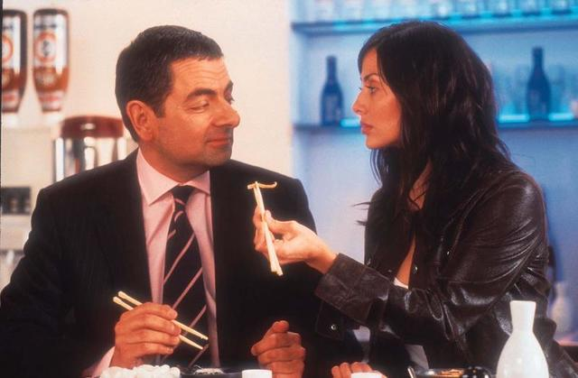

# neural-style-transfer-pytorch

This is my PyTorch implementation of [A Neural Algorithm of Artistic Style by Leon A. Gatys, Alexander S. Ecker & Matthias Bethge](https://arxiv.org/abs/1508.06576). Several other implementations exist online, including that of the author.

## Usage

- Install the dependencies in `requirements.txt`.
- In `main.py`, set your work dir, locations of the input images and the available hyper-parameters. It can also easily be adapted to run on several images or over various hyper-parametesr, as you wish.
- Run `main.py` to produce output image.

## Background

The main idea behind this paper is that:

1. The value of intermediate features in a neural network capture the content of the input image they are representing.
2. The covariance between the features in a layer reflects the style of the input image.

In this paper, this property is exploited to create images that have the content from one image with the style of another. The algorithm is roughly as follows:

1. Run a "content image" through a convolutional neural net (CNN), here VGG-16, and store one or several layers of intermediate features.
2. Run a "style image" through the same CNN, extracting features and computing the Gram matrix (similar effect to covariance matrix but cheaper to compute).
3. Initialise your output image, either as random noise or from your content image.
4. Run this through your network and obtain the raw features and gram matrix/matrices.
5. Optimise the values of your output image using gradient descent, so that the features and Gram matrix it produces match your content and style targets as best as possible. It is much like training a neural network normally except that your layer weights are fixed and instead your input values are the ones updated to minimise the loss, which in this case it the l2 distance between your current and target features and gram matrices.
6. Repeat steps 4 and 5 until you have an output image that you're happy with.

Several design choices and hyper-parameters exist that effect the look of the output image. Some of these are:

- Which layers are chosen to extract features for comparison and how these are weighted relative to eachother: giving greater weight to earlier layers puts more emphasis on preserving local features such as edges where as features in later layers represent larger structures in the image.
- The relative weight given between content and style loss components: this directly affects what balance is struck between these two aspects.
- The resolution/size of the style image relative to your content image: will directly affect the scale of the stylistic structures incorporated into the output image.

In this implementation I have followed the suggested settings from the paper, matching content representation on layer "conv4_2" and the style representations on layers "conv1_1", "conv2_1", "conv3_1", "conv4_1", "conv5_1" (weighted equally).

## Results

For the purpose of testing I have used a crop of a photo of St Paul's Cathedral in London as content image and a crop of a David Hockney painting as style image:

For reference, below are (1) the noise image optimisation starts from as reference, (2) an image optimised using only the content component of the loss, (3) an image optimised using only the style component of the loss:

It can be seen that only the rough structure of the content is captured and that it looks quite different to the original image. The style image seems to do ok at capturing the style of the original image.

Varying the relative weighting of content to style in the loss affects their prominence in the output. The following are using ratios of 100, 10, 1 and 0.1 respectively, all run for 100 iterations.

Likewise, number of iterations run affects the output qualitatively too. Here optimisation is run for 10, 50, 100 and 250 iterations repectively, all with a loss ratio of 1.0:

At 10 iterations the image is still forming but beyond 50 there isn't much change and the optimisation is probably near its local optimum.

Whilst the output is more or less doing what we expect, the quality of the images is very poor compared to those in the research paper. In particular the images are quite grainy and the colour is very patchy. As an alternative it is possible initialise the output image from the content image. Running with 1.0 loss ratio for 100 iterations from noise and from the content image respectively shows the difference.

Although it has not changed much in style, the output image initialised from the content image is qualitatively a lot more satisfying, with a lot less noise and truer to the original. This makes intuitive sense as it would seem easier for the optimiser to maintin the content features as they are, rather than create them from random.

Searching a few other settings shows some more results. These use 0.1, 0.001, 0.0001 and 0.0001 as weighting ratios and were run for 100, 100, 250 and 1000 iterations respectively.

In particular the last one of these is starting to look like what we expect from neural style transfer. This satisfies me that this implementation is more or less correct.

As a final step I've optimised on a larger content image (a frame from the Johnny English film), with some larger style images (paintings by Hockney, Renoir, Picasso and Miro). All images were run for 1000 iterations using a content/style weigting of 0.0001:

A search over hyper-parameters would probably yield some better results.

The author released another paper describing how to apply this method to higher resolution images. There are many other papers on the subject. For instance, one uses a neural network to learn an image's style and apply it quickly to any content image and another paper can apply the style from any image to any content image quickly.

## Notes

- The choice of whether to clip or re-scale the output image and whether to do this only at the end or also during optimisation greatly affects the output. Not editing the image during optimisation and then clipping at the end worked best for me.
- The paper suggests that using average pooling in your network works better than max pooling. I wonder if this might be the reason for the grainy outputs when starting from a random noise image.
- The author suggests using LBFGS optimiser and it works a lot better than when I was using Adam initially.

